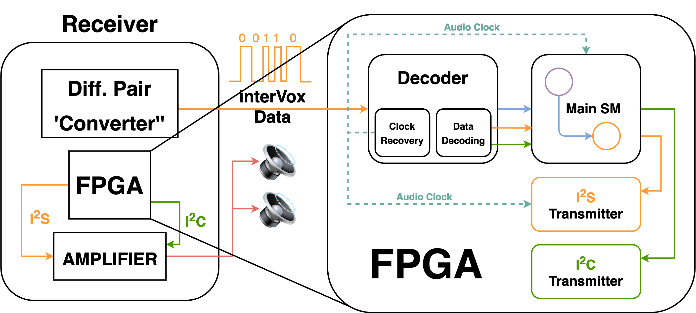

# interVox Receiver

The interVox receiver intends to decode interVox encoded data, transmitted over a biphase mark encoded signal. The interVox receiver consists, thus far, of: 
  * Clock recovery circuit
  * Data Decoder
  * I2S Transmitter

Current the interVox-Receiver is under rapid development, and as such is not particularly functional.